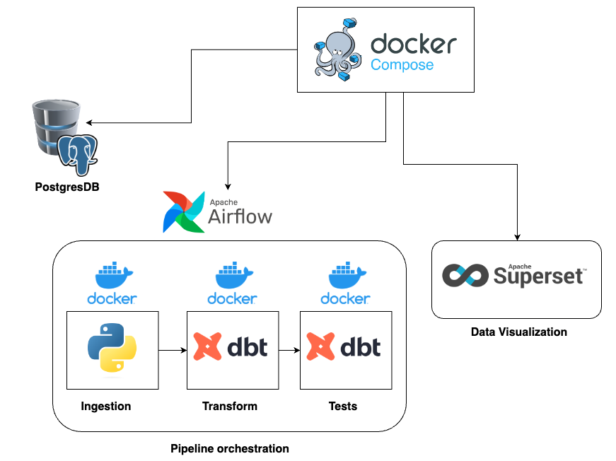
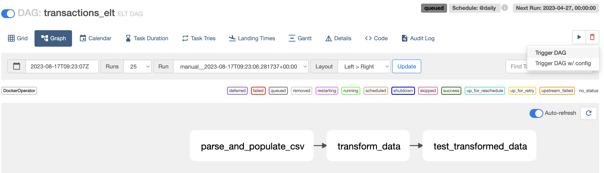
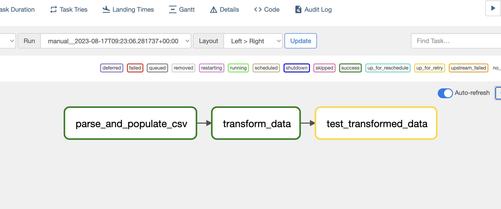
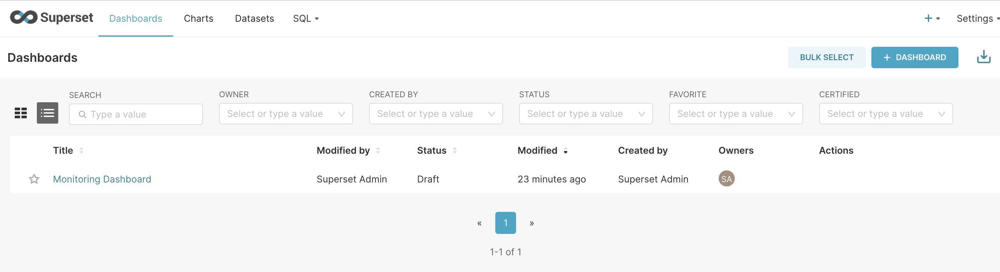
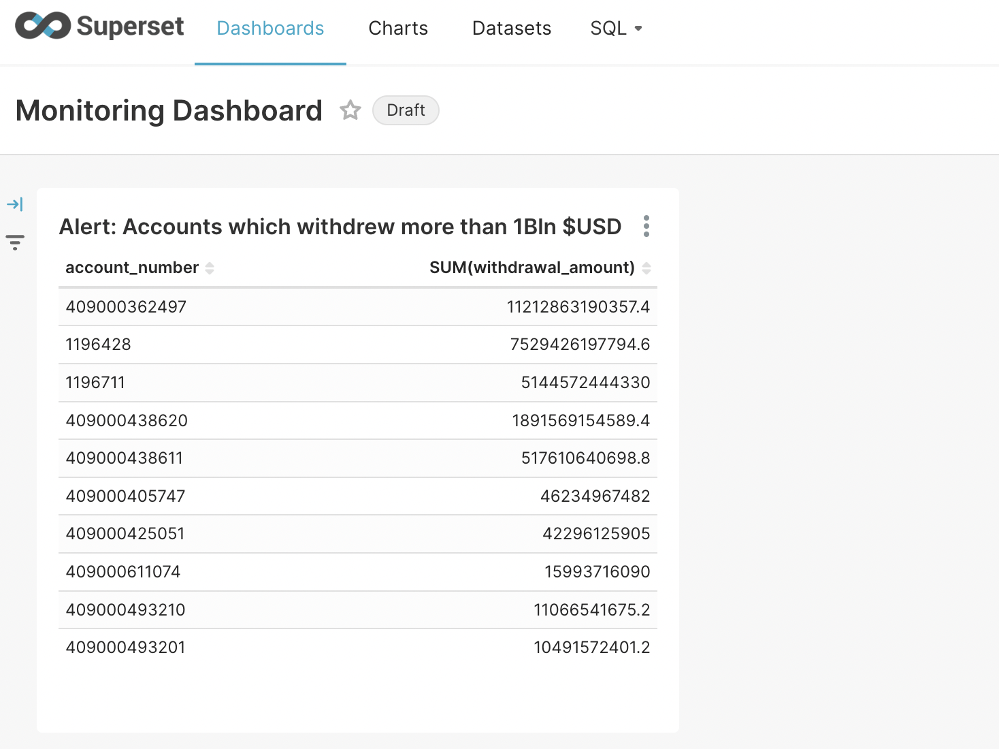

# tocos-assignment

## Target setup



## 1 - Prerequisites

This demo has been developed using MACOS Monterey v12.5, you may encouter DB host issues with docker-compose if you are running it on windows (You can change DB host to `host.docker.internal` in Apache superset for instance).

- [Docker](https://docs.docker.com/get-docker/)(8.0 GB of memory and 4 CPUs)
- [Docker Compose CLI plugin](https://docs.docker.com/compose/install/compose-plugin/)
- If running on windows: [Docker remote containers on WSL 2](https://docs.microsoft.com/en-us/windows/wsl/tutorials/wsl-containers)
- [dbt CLI (Optional)](https://docs.getdbt.com/docs/core/installation)(version installed for this demo: 1.6.0, postgres plugin: 1.6.0)

## 2 - Quickstart

DBT is a compiler and runner, it doesn't handle raw data loading directly so we use a Python script to load the CSV data. Note that a PostgresOperator in Airflow would do for the data ingestion but I didn't want to ingest the full CSV and PostgresOperator isn't great for custom CSV imports. Another workaround that could be used for the demo is using the DBT "seed" but it is only recommended for static data whilst the withdrawls history is dynamic data.

Orchestration with Airflow, add test task to DAG

```bash
make build-all-images
make up
```

You can now access:

[Airflow DAG](http://localhost:8080/dags/transactions_elt/graph)(running on localhost:8080)

username: `airflow`,
password: `airflow`

Now you should be able to see the `transactions_elt` DAG:



Manually trigger the DAG



The test task wil fail because one test does not pass.

Now you can open [Superset](http://localhost:8088/dashboard/list/)(running on localhost:8088)

username: `admin`, password: `admin`

And manually import the [example_dashboard_export.zip](./superset/example_dashboard_export.zip)(this should be done programmatically at init time in the container, but manual import will do for this demo)



You can now see the "Monitoring Dashboard" that contains one graph that displays the accounts which withdrew more than 1 billion $USD over the period. Note that very little formatting has been done as this was not the purpose of this demo.



## 3 - File structure

explain only top directories

```
.
 ├──init_db.sql // SQL Query run during initialization of postgresDB
 ├──docker-compose.yaml
 └──dbt
 │  ├──profiles.yml
 │  ├──tests
 │  │ ├──.gitkeep
 │  │ ├──ensure_withdrawal_or_deposit.sql
 │  │ └──value_date_greater_than_transaction_date.sql
 │  ├──models
 │  │ ├──staging
 │  │ │ ├──schema.yml
 │  │ │ ├──source.yml
 │  │ │ └──transactions.sql
 │  ├──macros // custom macro to override the schema name
 │  └──dbt_project.yml
 ├──Makefile  // Makes terminal interactions much faster
 ├──README.md
 ├──.gitignore
 ├──data_ingestion  // Contains the Python script
 │ ├──requirements.in
 │ ├──requirements.txt
 │ ├──Dockerfile
 │ ├──populate_csv_into_db.py
 │ └──data
 ├──superset/  // Superset custom app
 ├──docs  // Folder containing diagrams and screenshots
 └──airflow  // Custom Airflow app
```

## 4 - ELT

### Extract & Load

Python script that will read the CSV, remove duplicates and drop the last column, we don't want to store data that carries no information.

### Transform

DBT will read data from the raw schema, parse and format the data and finally dump it into the staging schema.

# Tests

- DBT tests are located under [./dbt/tests/](./dbt/tests/)
- The Python script should also have unit/functional tests but they have been omitted to keep the demo simple. You can refer to my other repo [financial-data-api](https://github.com/teddy-ambona/financial-data-api/tree/main/app/tests) if you want more details on python tests.

You will note that the Airflow task `test_transformed_data` fails. I leave it as fail to showcase its utility. if you look at the logs you will notice that not all value dates and greater than the transaction dae, which means some transactions are backdated.

## 5 - Data Visualization

Note that the superset service may take 4-5min to spin up.

## 6 - Improvements
- Add architecture diagram for ETL and data viz
- Dependency injections for test/dev/staging/prod environments
- Airflow DAGS and config should be included in the Docker image (mounting volumes allowed for fast iterations)
- Superset dashboard should be programmatically imported at init time

## 7 - Resources:
- [Running Airflow in Docker](https://airflow.apache.org/docs/apache-airflow/stable/howto/docker-compose/index.html)

# 8 - Useful commands

Check DBT DB connection status

```bash
dbt debug
```

Generate DBT documentation

```bash
dbt docs generate
dbt docs serve
```

Dry-run DBT
```bash
dbt compile
```

Run DBT tests
```bash
dbt test
```

## Task 2: 

*Please write up no more than 300 words on your opinions of the practical realities of taking a lakehouse approach to building a data stack vs a data mesh approach.*

Source of truth
Central vs decentralized
Data Mesh allows for redunduncies, this is offset by low compute cost and speed/flexibility that we wouldn't have with DWH

In either case we need high quality and reliable data